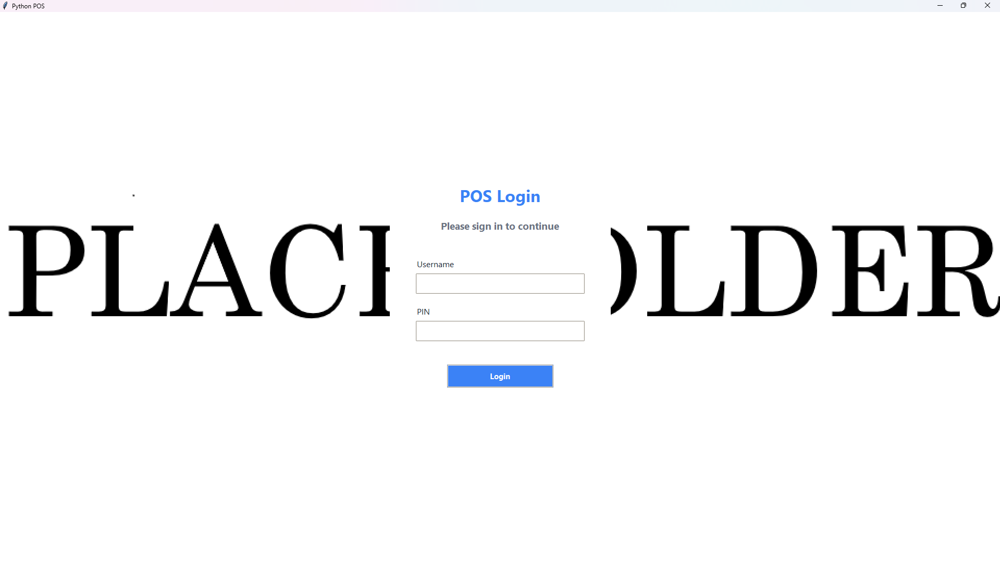
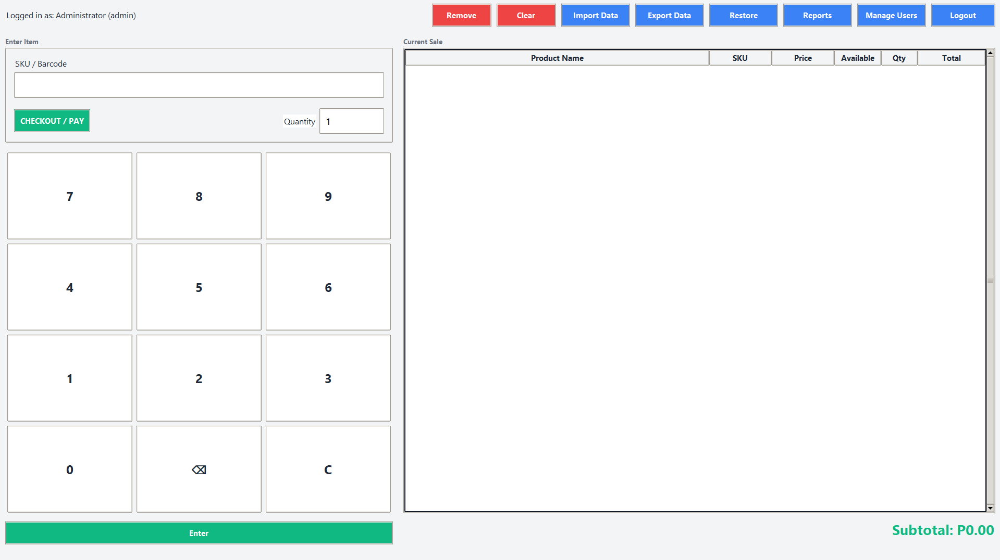
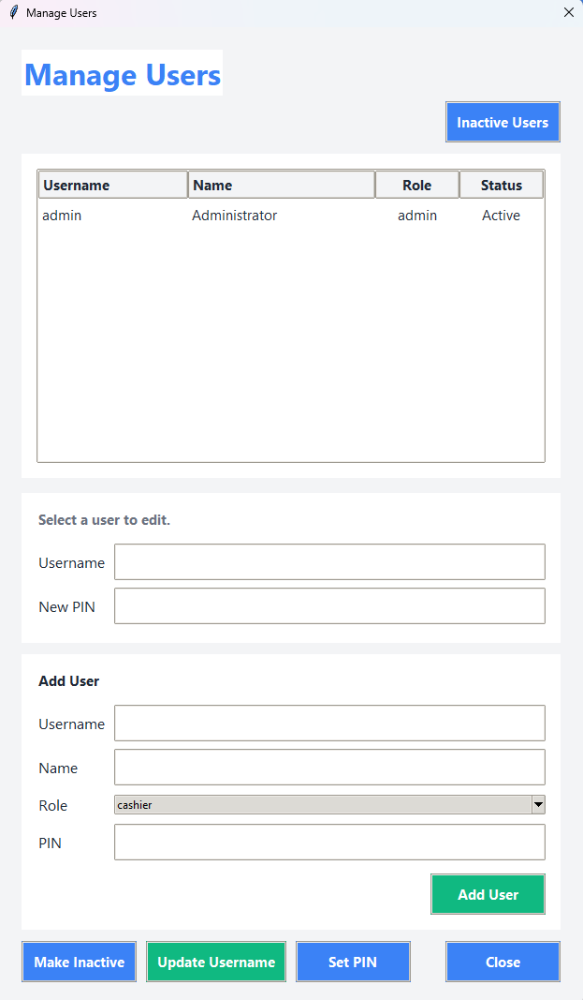

# Python POS

## Project Description

- What it does: Desktop point-of-sale system for product lookup, cart management, checkout, inventory adjustments, admin import/export, user management, backup/restore, and audit logging.
- Who it is for: Small retail or kiosk operations needing an offline-capable POS.
- Core purpose: Provide a lightweight, local POS workflow with inventory tracking and admin controls.

## Key Features

- User login with username or first name and PIN (PINs are stored hashed).
- Product lookup by SKU or barcode.
- Cart management with add/remove/clear actions and low-stock warnings.
- Checkout with discount, tax calculation, and payment methods (Cash, Card, E-Wallet).
- Sales logging with export to `sales.xlsx`.
- Product import from `.xlsx` or `.csv` with validation and preview; export to `.xlsx`.
- Admin-only actions for reports, database backup/restore, and user management.
- User management: add users, update usernames, reset PINs, activate/deactivate cashier accounts, and view inactive users.
- Audit logging for sales and admin actions.

## System Architecture

- Frontend/UI: Tkinter views and dialogs (`app/ui/views`, `app/ui/dialogs`).
- Controller layer: `PosController` coordinates UI actions and admin gating.
- Business logic: `PosService` and `CartService`.
- Data access: repository classes in `app/repositories/`.
- Database: SQLite file at `app/data/pos.db`.

## Tech Stack

- Language: Python.
- UI Framework: Tkinter (ttk).
- Database: SQLite (local file).
- Libraries:
  - `openpyxl` (required for `.xlsx` import/export).
  - Standard library modules: `sqlite3`, `csv`, `threading`, `logging`, `pathlib`.

## Installation & Setup

### Prerequisites

- Python 3.11+ (per `DOCUMENTATION.md`).
- `openpyxl` if you need Excel import/export.

### Installation Steps

1) Clone repository (https://github.com/jrpbone/Python-Point-of-Sale.git).
2) (Optional) Create and activate a virtual environment since env was installed globally.
3) Install Excel dependency if needed:

```bash
pip install openpyxl
```

## Usage

### Run the Application

```bash
python main.py
```


### Or create the .exe file

```
py -m PyInstaller --noconfirm --clean --name "PyPOS" --windowed --icon "assets\pos.ico" --add-data "assets;assets" --add-data "app\data;app\data" --contents-directory . main.py
```

### Basic Flow

1) Launch the app; the database schema and seed data are created on first run.
2) Log in:
   - Default admin user from `app/db.py`: username `admin`, PIN `admin`.
3) Add items by SKU or barcode and set quantities.
4) Checkout:
   - Enter discount and payment details.
   - Supported methods: Cash, Card, E-Wallet.
5) Admin actions (requires admin role or PIN prompt):
   - Manage users (create, reset PINs, activate/deactivate).
   - Import/export products.
   - Backup/restore the database.
   - View sales reports.

Note: The UI displays amounts in Php

## Project Structure

```
.
├─ app/
│  ├─ data/                 # Runtime DB, backups, logs
│  ├─ db.py                 # SQLite setup, schema, seed, backup/restore
│  ├─ models.py             # Product/User dataclasses
│  ├─ security.py           # PIN hashing and verification
│  ├─ settings.py           # Tax configuration
│  ├─ repositories/         # Table-level data access
│  ├─ services/             # POS business logic
│  └─ ui/
│     ├─ controllers/       # UI controller (PosController)
│     ├─ dialogs/           # Admin, payment, import, report dialogs
│     ├─ services/          # CartService
│     ├─ views/             # Login and POS views
│     └─ config.py          # UI constants and theme
├─ assets/                  # UI assets (e.g., login background)
├─ tests/                   # Smoke tests
├─ main.py                  # App entry point
├─ DOCUMENTATION.md         # Detailed internal documentation
├─ products.xlsx            # Default import template
├─ dbProducts.xlsx          # Export output (generated)
└─ sales.xlsx               # Sales export log (generated)
```

## Configuration

- `app/ui/config.py`: UI palette, fonts, spacing, and widget sizing.
- `app/settings.py`: Tax settings (`TAX_RATE`, `TAX_ROUNDING`).
- `app/db.py`: Database path (`app/data/pos.db`) and seed users.
- .ini / .env: Not specified (no external config loader in code).

# Images

Log in UI

* Use PNG file, place inside /assets folder.



POS UI



User management dialog box: Admin access only


