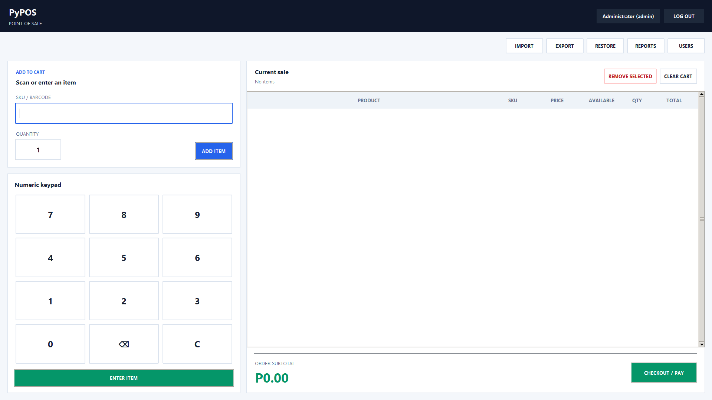
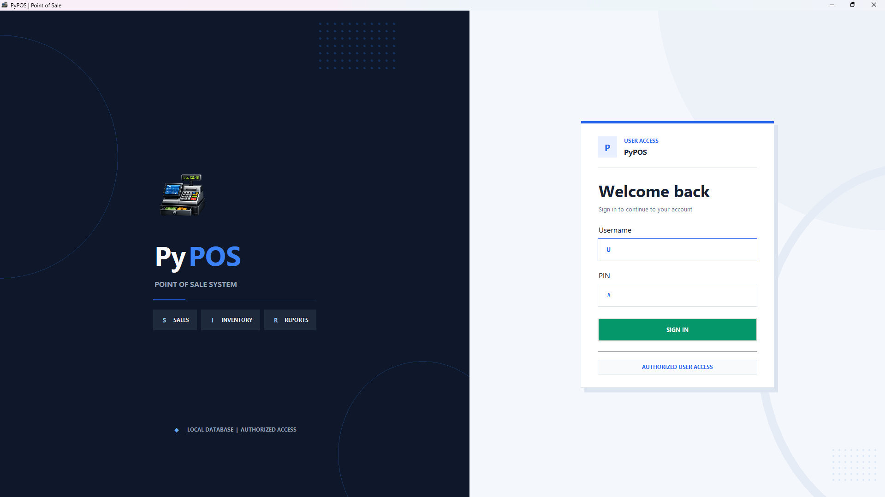

<div align="center">

# PyPOS

### A lightweight, offline point-of-sale system built with Python

Run sales, track inventory, manage staff, and keep business data on the device - without a browser or cloud service.

[](https://www.python.org/downloads/)
[](https://docs.python.org/3/library/tkinter.html)
[](https://www.sqlite.org/)
[](LICENSE)

[Get started](#quick-start) | [Explore features](#features) | [Read the docs](DOCUMENTATION.md)

</div>



## Overview

PyPOS is a desktop checkout application for small shops, kiosks, and learning projects. It combines a keyboard-friendly sales screen with local SQLite storage, role-based administration, spreadsheet import/export, and automatic database backups.

The application runs entirely on the local machine. Its layered Python codebase also makes it a practical reference project for Tkinter UI architecture, service/repository separation, and transactional SQLite workflows.

## Features

| Checkout | Inventory and data | Administration |
| --- | --- | --- |
| SKU and barcode lookup | Live stock adjustments | Admin and cashier roles |
| Quantity and cart controls | Low-stock warnings | PIN-based authentication |
| Cash, card, and e-wallet payments | CSV/XLSX product import | User creation and PIN resets |
| Discounts and configurable tax | Product and sales exports | Cashier activation/deactivation |
| Change calculation | Local SQLite persistence | Reports and audit logging |
| Automatic sales recording | Backup on logout and safe restore | Protected cart and data actions |

## Interface

<details open>
<summary><strong>Secure login</strong></summary>
<br>



</details>

## Quick start

### Requirements

- Python 3.11 or newer
- Tkinter (included with standard Windows and macOS Python installations)
- `openpyxl` for Excel imports and exports

### Install and run

```bash
git clone https://github.com/jrpbone/Python-Point-of-Sale.git
cd Python-Point-of-Sale

python -m venv .venv
```

Activate the virtual environment:

```powershell
# Windows PowerShell
.\.venv\Scripts\Activate.ps1
```

```bash
# macOS / Linux
source .venv/bin/activate
```

Install the application dependencies and launch the app:

```bash
python -m pip install -r requirements.txt
python main.py
```

On first launch, PyPOS creates its database and seeds the administrator account.

| Username | PIN | Role |
| --- | --- | --- |
| `admin` | `admin` | Administrator |

> [!IMPORTANT]
> The seeded credentials are intended for local evaluation. Change the administrator PIN before using the application with real business data.

## Basic workflow

1. Sign in and import the sample `products.xlsx` catalog, or load your own CSV/XLSX file.
2. Enter or scan a product SKU/barcode, choose a quantity, and add it to the current sale.
3. Select **Checkout / Pay**, then enter the discount, payment method, and amount received.
4. Use the admin toolbar to export data, view reports, manage users, or restore a backup.

Amounts are displayed in Philippine pesos (`Php`). Tax is disabled by default and can be configured in [`app/settings.py`](app/settings.py).

## Architecture

```text
Tkinter views and dialogs
          |
          v
     PosController
          |
          v
 PosService / CartService
          |
          v
 Repository classes
          |
          v
        SQLite
```

The UI delegates workflows to the controller, business rules live in services, and repositories isolate table-level database access. This keeps presentation, transaction logic, and persistence independently maintainable.

```text
.
|-- app/
|   |-- data/             # Runtime database, logs, and backups
|   |-- repositories/     # SQLite data-access layer
|   |-- services/         # Sales and inventory business logic
|   |-- ui/
|   |   |-- controllers/  # UI workflow coordination
|   |   |-- dialogs/      # Payment and admin dialogs
|   |   |-- services/     # Cart state and calculations
|   |   `-- views/        # Login and POS screens
|   |-- db.py             # Schema, seed, backup, and restore
|   |-- security.py       # PIN hashing and verification
|   `-- settings.py       # Tax configuration
|-- tests/                # Smoke tests
|-- main.py               # Application entry point
|-- products.xlsx         # Sample product catalog
`-- DOCUMENTATION.md      # Detailed technical documentation
```

## Data and backups

PyPOS creates operational files locally; generated databases, backups, exports, and logs are excluded from version control.

| File or directory | Purpose |
| --- | --- |
| `app/data/pos.db` | SQLite application database |
| `app/data/backups/` | Timestamped logout and pre-restore backups |
| `app/data/pos.log` | Rotating runtime log |
| `sales.xlsx` | Checkout export log |
| `dbProducts.xlsx` | Exported product catalog |

## Development

Run the comprehensive test suite from the repository root:

```bash
python test.py
```

The suite covers authentication, user management, product imports, cart behavior, checkout transactions, inventory, reporting, spreadsheets, backup/restore, controller flows, application resources, and Tkinter screen construction. For a file-by-file guide to the codebase and its workflows, see [`DOCUMENTATION.md`](DOCUMENTATION.md).

### Build a Windows executable

Install PyInstaller, then run:

```powershell
python -m pip install pyinstaller
python -m PyInstaller --noconfirm --clean PyPOS.spec
```

The standalone application is written to `dist/PyPOS.exe`. Runtime data is
stored in `%LOCALAPPDATA%\PyPOS` so sales and settings persist between launches.

## Contributing

Issues and pull requests are welcome. When making a change, keep database access inside repositories, business rules inside services, and UI event handling inside the controller layer. Please run the smoke tests before submitting a pull request.

## License

PyPOS is released under the [MIT License](LICENSE).
